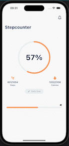

# Step Counter

## User stories

- As a User, I want to synchronize my steps with my preferred health source
- As a User, I want to set my daily goal
- As a User, I want to see how many steps I have achieved today
- As a User, I want to see how many calories I have burned with my steps
- As a User, I want to get a reminder at 8 pm if I have NOT achieved my goal

## Recording

## Architecture

The application uses a feature-driven directory structure. This project structure enables to scale the project by having self-contained features. At the moment we only have a single feature (the step counter) but in more complex applications we can have more features. This enables to scale as the number of features increases and allows developers to work on different features in parallel.

## Packages Used

- cupertino_icons
- flutter_bloc
- bloc
- json_serializable
- json_annotation
- equatable
- injectable
- get_it
- shared_preferences
- flutter_local_notifications
- notification_permissions
- workmanager
- percent_indicator
